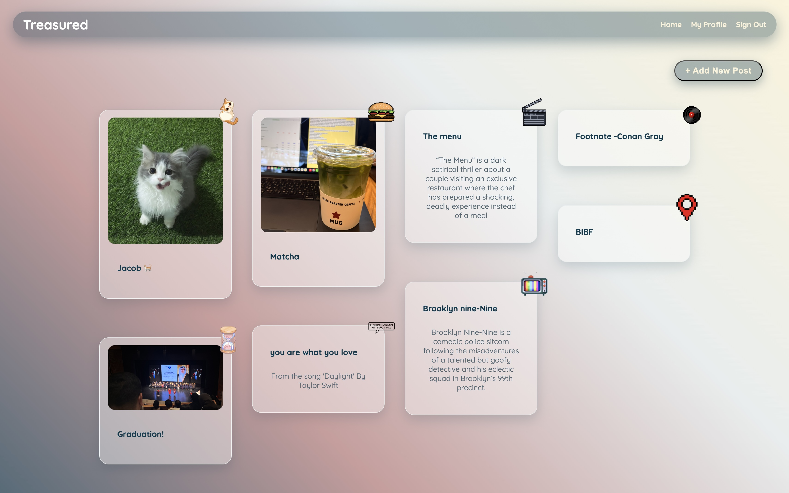
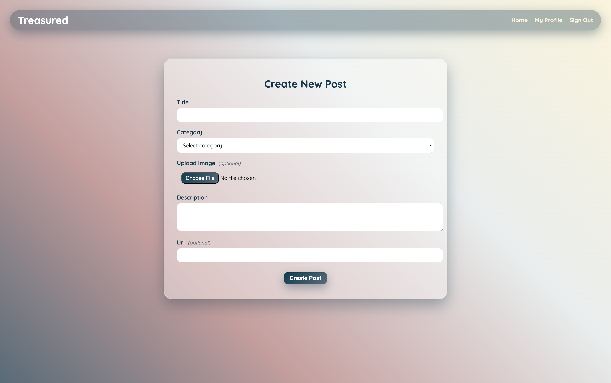

# Treasured
### _“Your world, beautifully collected.”_
A personalized space where users express their tastes, share their favorites, and discover new content.

## ✨ Overview

**Treasured** creates a unique environment where users curate a profile filled with their favorite **songs**, **shows**, **foods**, **pets**, **quotes**, and more.
Every profile becomes a window into someone’s world

## 🌐 Live Deployment
👉 **Visit Treasured Live:** https://treasured.onrender.com/

## 🖼️ Preview
Here’s a quick look at Treasured in action:

### 🔹 Home Page

### 🔹 Create Post

## 📐 Wireframes
Original project wireframes:
👉 **Wireframes:** https://ga-tamkeenbh.slack.com/archives/C09QN41PW5T/p1762278625736609

## 🌟 Features

### 🎨 Personal Profile Spaces
- Build a custom profile that reflects your favorite media and interests.
- Add posts for music, shows, food, pets, aesthetics, quotes, and more.

### 🌍 Explore the Community
- View profiles from other users.
- Discover new tastes, inspirations, and ideas through shared content.

### 🗂️ Category Filtering
- Filter profiles by category (_Songs_, _Pets_, _Quotes_, etc.)
- Quickly browse content based on your interests.

### 📝 Post & Share
- Users can publish posts to their profile.
- Posts are visible to others, helping everyone discover new favorites.

## 🛠️ Tech Stack

## 🗂️ Team Trello Board
👉 **Trello Board:** https://trello.com/b/LwctLAQJ/treasured-temp

## 🧩 ERD (Entity Relationship Diagram)

## 🔮 Future Improvements
- **Direct Messaging** between users
- **Pinned Posts** on profiles
- Expanded profile customization
- More content types & discovery features
